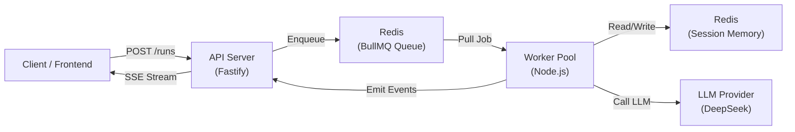

# Architecture & System Design

**Purpose:** Understand how mint-ai works internally  
**Audience:** Engineers, architects  
**Reading time:** 15-20 minutes

---

## System Overview

```
┌───────────────────────────────────────────────────┐
│ CLIENT APPLICATION                                │
│ (Web UI, Mobile, Third-party)                     │
└────────────────┬────────────────────────────────────┘
                 │ REST/SSE
         ┌───────▼────────┐
         │ FASTIFY API    │
         │ • POST /runs   │
         │ • GET /stream  │
         └───────┬────────┘
                 │
        ┌────────┴────────┐
        │                 │
    ┌───▼─────────┐  ┌──▼──────────────┐
    │ REDIS       │  │ DJANGO (Future) │
    │ • Queues    │  │ • DB Storage    │
    │ • Memory    │  │ • Workflows     │
    └───┬─────────┘  └─────────────────┘
        │
    ┌───▼──────────────────────────┐
    │ WORKFLOW ENGINE              │
    │ • BullMQ Worker Pool         │
    │ • Executor Registry          │
    │ • Graph Runner               │
    └──────────────────────────────┘
```

---

## Core Components

### 1. API Server (Fastify)

**File:** `src/apps/api/`

**Responsibility:** HTTP interface, request validation, response formatting

**Endpoints:**

```
POST /v1/runs
  • Enqueue a workflow run
  • Validate input schema
  • Return 202 (Accepted) with runId

GET /v1/runs/:runId/stream
  • Open SSE connection
  • Stream events as they happen
  • Support reconnects via Last-Event-ID

GET /v1/runs/:runId
  • Get run status and result

POST /v1/runs/chat
  • Synchronous chat (waits for response)
  • Useful for simple single-turn interactions
```

**Key detail:** API is **stateless**. All state managed by Redis or queued in BullMQ.

---

### 2. BullMQ Job Queue

**Files:**
- `src/orchestrator/queue/` – Queue setup
- `src/orchestrator/worker/` – Job processors

**Why?** Reliable job scheduling with retry logic and horizontal scaling.

**How it works:**

```
┌─────────────────────────────────────────────┐
│ Redis (BullMQ)                              │
├─────────────────────────────────────────────┤
│ Queue: "runs"                               │
│ • Job: { runId, workflowId, input }         │
│ • State: waiting → active → completed       │
│ • Retry: Auto-retry with exponential backoff│
│                                             │
│ Queue: "nodes"                              │
│ • Job: { runId, nodeId, input }             │
│ • State: waiting → active → completed       │
│ • Retry: Up to 5 times                      │
└─────────────────────────────────────────────┘
```

**Worker Pool:**

Multiple worker processes pull jobs from queues and execute them. Load is automatically balanced by BullMQ.

```bash
# Start 3 workers
npm run dev-worker &  # Worker 1
npm run dev-worker &  # Worker 2
npm run dev-worker &  # Worker 3
```

All pull from same Redis queues. BullMQ ensures each job is processed exactly once.

---

### 3. Workflow Runner (Graph Engine)

**File:** `src/orchestrator/runner/advanceWorkflow.ts`

**Responsibility:** Graph traversal logic

**How it works:**

```
When a node finishes:
  1. Get the node's result
  2. Query workflow graph: "What edges exit this node?"
  3. For each successor:
     - Enqueue successor node to "nodes" queue
     - Emit event: node.finished
  4. If no successors:
     - Emit event: run.finished
     - Mark run as complete
```

**Example:**

Workflow: `guard.policy → agent.reasoning`

```
Step 1: guard.policy finishes successfully
  → Find successors: [agent.reasoning]
  → Enqueue agent.reasoning job

Step 2: agent.reasoning finishes
  → Find successors: []
  → No more nodes → run complete
  → Emit run.finished
```

**Key insight:** Workflows are **lazy DAGs**. Successors are enqueued only when their predecessor completes. This allows:
- Conditional branching (enqueue different successors based on output)
- Dynamic workflows (generate successors at runtime)
- Parallel execution (enqueue multiple successors)

---

### 4. Executor Registry

**File:** `src/executors/index.ts`

**Responsibility:** Map `kind` (node type) → executor function

**How it works:**

```typescript
const executors = {
  "system.guardPolicy": nodeGuardPolicy,
  "agents.reasoning": nodeAIReasoning,
  "tools.apicall": toolApiCall,
  // ... more executors
};

// Lookup
const executor = executors["agents.reasoning"];
const result = await executor(input, ctx);
```

**Node Types:**

| Kind | Category | Purpose |
|------|----------|---------|
| `system.guardPolicy` | System | Validate input |
| `system.noop` | System | No-op pass-through |
| `agents.reasoning` | Agent | AI reasoning with tools |
| `tools.apicall` | Tool | HTTP API call |
| `tools.chatModels.*` | Tool | LLM provider |

---

### 5. Session Memory (Redis)

**File:** `src/shared/memory/`

**Two data structures per session:**

#### Messages (Redis LIST)
```
Key: session:{sessionId}:messages
Type: [ { role: "user", content: "..." }, ... ]
Behavior:
  • LPUSH to prepend new message
  • LTRIM to keep last N messages (bounded)
  • EXPIRE to auto-cleanup after 24h
```

Example:
```
session:user-123:messages =
  { role: "assistant", content: "I found..." }
  { role: "user", content: "Show me shoes" }
  { role: "assistant", content: "What budget?" }
  { role: "user", content: "Under $150" }
```

#### Summary (Redis JSON)
```
Key: session:{sessionId}:summary
Type: { phase: "...", intent: "...", budget: "...", ... }
Behavior:
  • Loaded at start of each turn
  • Merged with AI's latest summary
  • Persisted back to Redis
```

Example:
```
session:user-123:summary =
{
  "phase": "product_browsing",
  "intent": "shoe_search",
  "budget": "$100-150",
  "products_shown": 2
}
```

**Why this design?**
- **Bounded:** Only recent N messages; older ones dropped
- **Efficient:** O(1) lookups; summaries reduce token count
- **Scalable:** Redis is fast; session-aware isolation

---

### 6. Executor Context (Dependency Injection)

**File:** `src/shared/executor-context/`

**What it is:** Bundle of dependencies passed to every executor

```typescript
interface ExecutorContext {
  // IDs
  requestId: string;
  runId: string;
  nodeId: string;
  sessionId?: string;

  // Dependencies
  redis: Redis;              // Redis client
  logger: Logger;            // Pino logger
  models: ModelRegistry;     // LLM adapters
  metrics: Metrics;          // Observability
  config: RuntimeConfig;     // Settings
  memory: SessionMemory;     // Session store
  eventBus: EventBus;        // SSE pub/sub

  // Methods
  isCancelled(): Promise<boolean>;
  emitEvent(type, data): Promise<void>;
}
```

**Why?** **Testability & reusability.** Mock the context; no real Redis/LLM needed. Swap implementations easily.

---

## Request Flow (Detailed)

### Step 1: Client Enqueues Run

```
POST /v1/runs
{
  "workflowId": "momo.salesbot",
  "sessionId": "user-123",
  "input": { "message": "Hi!" }
}
```

**API does:**
```
1. Validate input schema (Zod)
2. Create run record in memory: { runId, status: "queued" }
3. Enqueue to "runs" queue: { runId, workflowId, sessionId, input }
4. Return 202: { runId: "run-abc-123", status: "queued" }
```

---

### Step 2: Runs Worker Processes Orchestration

**Worker pulls job from "runs" queue:**

```
Job: { runId: "run-abc-123", workflowId: "momo.salesbot", ... }

Worker does:
  1. Load workflow definition: momo.salesbot
  2. Find entry nodes: ["guard.policy"]
  3. For each entry node:
     - Create job: { runId, nodeId, input }
     - Enqueue to "nodes" queue
     - Emit: run.started
  4. Mark job completed
```

**Event emitted:**
```json
{
  "type": "run.started",
  "runId": "run-abc-123",
  "timestamp": "2026-06-04T10:00:00Z"
}
```

---

### Step 3: Nodes Worker Processes Individual Node

**Worker pulls job from "nodes" queue:**

```
Job: { runId: "run-abc-123", nodeId: "guard.policy", input: {...} }

Worker does:
  1. Create ExecutorContext with dependencies
  2. Resolve executor: "guard.policy" → nodeGuardPolicy
  3. Call executor: nodeGuardPolicy(input, ctx)
  4. Executor returns: Result<output, error>
  5. If ok():
     - Persist result
     - Query successors
     - For each successor: enqueue job
     - Emit: node.finished with result
  6. If err():
     - Mark job for retry (if retryable)
     - Emit: error event
```

**Events emitted:**
```json
{ "type": "node.started", "nodeId": "guard.policy", ... }
{ "type": "node.finished", "nodeId": "guard.policy", "result": {...} }
```

---

### Step 4: Executor Runs (Example: agents.reasoning)

**Executor: nodeAIReasoning**

```typescript
async function nodeAIReasoning(input, ctx) {
  // 1. Validate input
  const parsed = schema.safeParse(input);
  if (!parsed.success) return err({ code: "INVALID_INPUT", ... });

  // 2. Fetch context from Redis
  const messages = await ctx.memory.getSessionMessages(sessionId, 10);
  const summary = await ctx.memory.getSessionSummary(sessionId);

  // 3. Build LLM prompt
  const prompt = [
    { role: "system", content: "You are helpful..." },
    ...messages,
    { role: "user", content: input.message }
  ];

  // 4. Call LLM with tools
  const response = await ctx.models.invoke("deepseek.chat", prompt, {
    tools: config.tools
  });

  // 5. Tool-calling loop (max 3 iterations)
  let toolCalls = 0;
  while (toolCalls < 3 && response.toolCalls.length > 0) {
    // Execute each tool
    for (const toolCall of response.toolCalls) {
      const result = await executeTool(toolCall, ctx);
      prompt.push({ role: "tool", content: result });
    }
    // Recap to LLM
    response = await ctx.models.invoke("deepseek.chat", prompt);
    toolCalls++;
  }

  // 6. Parse output as JSON
  const output = parseJson(response.content);

  // 7. Persist to session
  await ctx.memory.addSessionMessage(sessionId, {
    role: "user",
    content: input.message
  });
  await ctx.memory.addSessionMessage(sessionId, {
    role: "assistant",
    content: output.reply
  });
  await ctx.memory.updateSessionSummary(sessionId, output.summary);

  // 8. Record metrics
  ctx.metrics.recordTokens(ctx.runId, {
    input: response.inputTokens,
    output: response.outputTokens
  });

  // 9. Return result
  return ok({
    reply: output.reply,
    summary: output.summary
  });
}
```

---

### Step 5: Workflow Runner Advances

**When node finishes successfully:**

```
1. Query graph: workflow.edges.filter(e => e.source === nodeId)
2. Found successors: ["agent.reasoning"] (if this was guard.policy)
3. For each successor:
   - Create job: { runId, nodeId: "agent.reasoning", input: {...} }
   - Enqueue to "nodes" queue
   - Emit: node.finished
4. Mark node as completed
```

**When no successors:**
```
1. Emit: run.finished
2. Store final result
3. Mark run as completed
```

---

### Step 6: SSE Streaming (Parallel)

**Client opens:** `GET /v1/runs/run-abc-123/stream`

**Server subscribes to events for runId and streams them:**

```
event: run.started
data: {"runId":"run-abc-123","timestamp":"..."}

event: node.started
data: {"nodeId":"guard.policy","timestamp":"..."}

event: node.finished
data: {"nodeId":"guard.policy","result":{"allow":true},"timestamp":"..."}

event: node.started
data: {"nodeId":"agents.reasoning","timestamp":"..."}

event: token
data: {"partial":"Hello"}

event: token
data: {"partial":" there!"}

event: node.finished
data: {"nodeId":"agents.reasoning","result":{"reply":"Hello there!..."},"timestamp":"..."}

event: run.finished
data: {"runId":"run-abc-123","finalResult":{...},"timestamp":"..."}

: keepalive
```

---

## Error Handling

### Error Flow

```
Executor throws error or returns err(...)
  ↓
Worker catches error
  ↓
Is error retryable?
  ├─ Yes → Re-enqueue job with exponential backoff
  │       (1s, 2s, 4s, 8s, 16s, then fail)
  │
  └─ No → Move to failed queue
         Emit: run.failed
         Log error details
```

### Error Types

```typescript
// Result types force error handling
type Result<T, E> = Ok<T> | Err<E>;

// Executor returns explicit errors
return err({
  code: "INVALID_INPUT",
  message: "Message too long",
  retryable: false  // Won't retry
});

return err({
  code: "LLM_ERROR",
  message: "Rate limit exceeded",
  retryable: true  // Will retry
});
```

---

## Performance Characteristics

| Operation | Time | Notes |
|-----------|------|-------|
| Enqueue run | <10ms | Quick HTTP POST |
| Guard validation | <50ms | In-memory check |
| LLM inference | 1-5s | Model dependent |
| Tool call | 500ms-2s | API latency |
| End-to-end workflow | 3-10s | Nodes + LLM |
| SSE event delivery | <100ms | In-process |

---

## Scaling

### Horizontal Scaling

```bash
# Start multiple workers
npm run dev-worker &
npm run dev-worker &
npm run dev-worker &
npm run dev-worker &
```

All workers pull from same Redis queues. BullMQ automatically distributes jobs.

**Capacity:**
- 1 worker: ~50 nodes/sec
- 4 workers: ~200 nodes/sec
- 16 workers: ~800 nodes/sec

(Depends on executor complexity and LLM latency)

### Vertical Scaling

```typescript
// Increase concurrency per worker
const queue = new Queue("nodes", {
  defaultJobOptions: {
    attempts: 5,
    backoff: { type: "exponential", delay: 1000 }
  },
  settings: {
    maxStalledCount: 2,
    lockDuration: 30000,
    lockRenewTime: 15000,
    max: 100  // Process 100 jobs in parallel
  }
});
```

---

## Data Flow Diagram (Mermaid)



---

## Key Design Decisions

### 1. Job Queue (BullMQ)
**Why:** Reliable, retryable, horizontally scalable  
**Tradeoff:** Redis dependency, operational complexity

### 2. Bounded Session Memory
**Why:** Prevents token bloat, forces summarization  
**Tradeoff:** Oldest messages are lost

### 3. Result Types Instead of Exceptions
**Why:** Type-safe error handling, forced error propagation  
**Tradeoff:** More verbose than throw/catch

### 4. Graph-based Workflows
**Why:** Flexible, composable, testable  
**Tradeoff:** Upfront workflow definition (not fully dynamic)

### 5. Stateless Node.js
**Why:** Horizontal scalability, no in-process state loss  
**Tradeoff:** All state must be persisted

---

## Next Steps

1. **Create a workflow** → [04-WORKFLOWS.md](./04-WORKFLOWS.md)
2. **Write an executor** → [05-EXECUTORS.md](./05-EXECUTORS.md)
3. **Handle errors** → [06-ERROR-HANDLING.md](./06-ERROR-HANDLING.md)

---

**Document:** 03-ARCHITECTURE.md  
**Updated:** 2026-06-04  
**Status:** Ready
